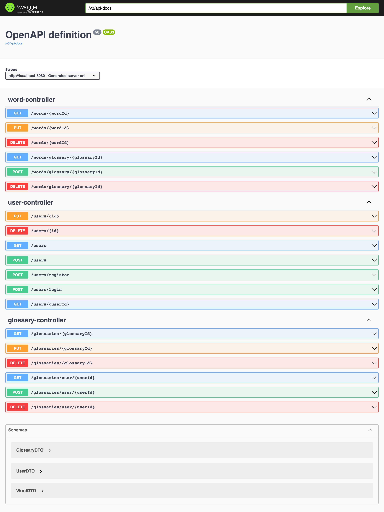

### Introduction
This is a flashcards application.

It has 3 parts: User, Glossary, Word. 
One user can set up many glossaries and one glossary can contain many words.

### Tech stack
* Java 17
* Gradle
* Spring Boot 3
* Spring Web
* Spring Data JPA
* Lombok
* H2
* MySql
* JUnit 5
* Mockito
* springdoc-openapi v2.0.2

### Run the application
Run in command line
```bash
./gradlew bootRun
```
Send requests with any REST client or curl or type in browser, 
eg. to GET all users
```
localhost:8080/users
```

### Doc
Access Swagger UI under http://localhost:8080/swagger-ui.html after starting the application.

